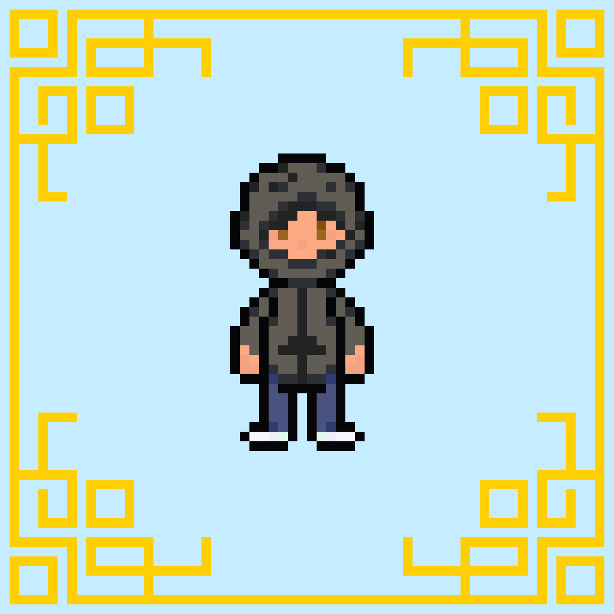

# Minigame de terminal em diferentes linguagens

Utilize os links na aba **"Índice"** para acessar os códigos e suas linguagens

## Índice📌

##### - [Tic-Tac-Toe [Java]](#Tic-Tac-Toe)
##### - [Skill Combat [Java]](#Skill-Combat)
 

## Java

### Tic-Tac-Toe
> Tic Tac Toe
> Jogo Da Velha

 

### Skill Combat

> Creation of a Combat System with Skills entirely in Java

> Criação de um sistema de Combate com Skills totalmente em Java

### Instruções:
##### - [Opções](#Opções)
##### - [Conceitos-Atributos](#Conceitos-Atributos)
##### - [Conceitos-Habilidades](#Conceitos-Habilidades)
##### - [Conceitos-Porcentagens](#Conceitos-Porcentagens)
##### - [Personagens](#Personagens)
* ##### [Kaique](#Kaique)

 

## Opções

####  1. Play: 
> Iniciar o jogo
####  2. Character Description: 
> Mostra uma descrição detalhada do personagem
####  3. Settings: 
> Acessa as configurações do jogo (Coming soon)
####  4. Credits:
> Acessa as informações sobre o criador do projeto
####  5. Credits: 
> Encerra o jogo

 

## Conceitos-Atributos
####  1. Life: 
> **Vida do personagem:** Se chegar em zero você perde.
####  2. Atk Damage: 
> **Dano bruto do personagem:** Influência no dado aplicado ao oponente
####  3. Defense: 
> **Defesa do personagem:** Influência no dano sofrido pelo oponente
####  4. Stamina: 
> **Energia:** Ela é consumida para utilizar as skills.
> Exemplo: Se a habilidade custa 50 de stamina e você só tem 30, não poderá usar a habilidade.
####  5. Stunned: 
> **Atordoado:** O inimigo fica atordoado e não pode atacar na vez dele.
####  6. Rooted: 
> **Enraizado:** O inimigo fica enraizado e pode atacar, mas não ganha stamina no seu turno.

 

## Conceitos-Habilidades
####  1. Passive: 
> **Passiva:** Ela é chamada automaticamente quando é o seu turno.
####  2. First Skill: 
> **Primeira Habilidade:** Ativa a primeira habilidade do personagem.
####  3. Second Skill: 
> **Segunda Habilidade:** Ativa a segunda habilidade do personagem.
####  4. Third Skill: 
> **Terceira Habilidade:** Ativa a terceira habilidade do personagem
####  5. Fourth Skill: 
> **Quarta Habilidade:** Ativa a quarta habilidade do personagem

 

## Conceitos-Porcentagens
#### 10% atk damage: 
> **Baseado no seu ataque:** Ele vai pegar o valor que equivale a 10% do seu dano, ou seja, se você tiver 100 de dano, ele vai pegar apenas 10.
#### 10% defense:
> **Baseado na sua defesa:** Ele vai pegar o valor que equivale a 10% da sua defesa, ou seja, se você tiver 100 de defesa, ele vai pegar apenas 10.
#### 10% life:
> **Baseado na sua vida:** Ele vai pegar o valor que equivale a 10% da sua vida, ou seja, se você tiver 100 de vida, ele vai pegar apenas 10.
#### 10% enemy life:
> **Baseado na vida do inimigo:** Ele vai se basear na vida do inimigo, ou seja, se o inimigo possuir 100 de vida, ele devolve 10, mas se o inimigo possuir 50, ele vai devolver 0,5.

 

## Personagens

#### Kaique:

    

 

| Life   | Atk Damage   |    Defense    | Stamina |
| :---:  |    :----:    |     :----:    |  :----: |
|   100  |      10      |       10      |   100   |

####  1. Passive: 
> **Passiva:** (Gym Mouse): At the beginning of the round Kaique is in the "pump" and receives +3 attack
####  2. First Skill: 
> **Primeira Habilidade:** (Headbutt 5000L): Kaique attacks with his head dealing 10+20%+ (12) atkdamage, has a 50% chance to stun
####  3. Second Skill: 
> **Segunda Habilidade:** (Offend Minority): Kaique makes jokes that offend minorities, whoever listens suffers 30+5% (31) of atkdamage
####  4. Third Skill: 
> **Terceira Habilidade:** (Isolation): Kaique isolates herself by gaining 40% (4) armor and restoring 50% (50) of his stamina
####  5. Fourth Skill: 
> **Quarta Habilidade:** (Wear Hood): Kaique dons his hood and becomes more focused, gaining 20 atkdamage, 20 armor and recovering 40 stamina per round. Lasts 3 rounds